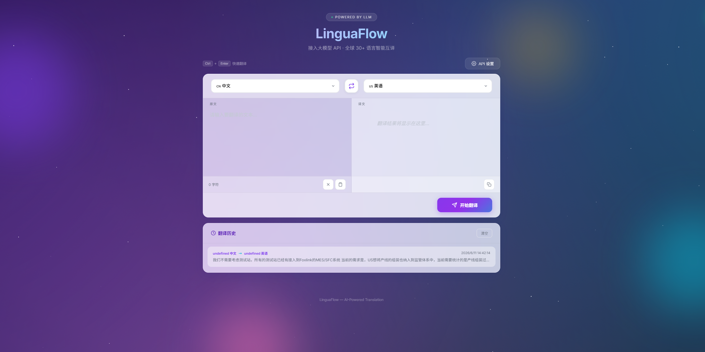

# AI Tool Box · AI 智能翻译与效率工具集

> 基于大模型 API 的在线翻译工具，支持网页版和 Chrome 扩展，全球 30+ 语言互译，支持划词翻译。


**语言 / Language**：中文 | [English](README_EN.md)

---

## ✨ 功能特性

### 网页版

- **30+ 语言互译** — 中文、英语、日语、韩语、法语、德语、西班牙语、俄语、阿拉伯语等全球常用语言
- **灵活接入** — 支持任意兼容 OpenAI Chat Completions 接口的大模型（OpenAI、DeepSeek、通义千问、智谱 GLM/编码计划、月之暗面 Kimi、阿里云百炼 Token Plan、Ollama 等）；全模块统一 URL 归一化与推理模型参数自适应，详见「模型兼容性说明」
- **深度上下文翻译** — AI 翻译前执行 5 步深度分析（领域识别→文体判断→语气分析→受众定位→意图理解），译文更精准自然
- **原始格式保留** — 完整保留 Markdown、HTML、代码块等原始格式，翻译后自动整理排版
- **Chrome 扩展全屏模式** — Popup 右上角新增「全屏按钮」，点击后在新标签页打开完整翻译界面（无高度限制）
- **弹窗高度动态适配** — 最大高度改为 `screen.availHeight`，可拖拽到屏幕最底部
- **6 款极简高级感主题一键切换** — 低饱和苹果风，浅色（纸感白 Paper / 雾霭 Mist / 奶油 Cream）× 深色（石墨 Graphite / 板岩 Slate / 夜曲 Midnight）各 3 款，中性分层背景、克制强调色点睛、苹果式文字阶梯、极细中性边框 + 柔和弥散阴影，右下角悬浮面板切换，默认石墨黑（Graphite）
- **品牌化标题排版** — 主标题采用 Sora 展示字体（异步加载，回退 Syne/Plus Jakarta Sans），渐变文字 + 光晕，clamp 自适应全断点
- **打字机效果** — 翻译结果逐字显示，体验流畅
- **翻译历史** — 自动保存最近 20 条翻译记录，点击即可回填
- **便捷操作** — 一键交换语言、粘贴、清空、复制翻译结果
- **快捷键** — `Ctrl + Enter` 快速翻译
- **数据本地化** — API 配置与历史记录保存在浏览器 localStorage，隐私安全
- **响应式设计** — 完美适配桌面与移动端
- **记录全端双向同步** — 网页版、Chrome 扩展弹窗与侧边栏三端的任务、卡片、各类历史记录实时互通（任一端增删改，另两端即时上屏），刷新后依然存在；AI 配置一处保存全端生效
- **历史记录导出** — 智能翻译历史、工作报告、邮件总结、英语学习历史、热点雷达卡片均支持一键导出为本地 JSON 文件
- **工作报告** — 内置工作报告生成器，支持 AI 一键总结、历史记录管理、按日期筛选
- **任务清单** — 内置任务管理模块，支持添加/完成/删除任务、优先级标记、进度统计、Markdown 批量导入/导出（含 checkbox 语法）、Apple 提醒事项一键导入（URL Scheme 点击即运行 + AppleScript 文件备用）、Google Calendar 同步、.ics 日历下载
- **英语学习助手** — 内置英语学习模块，支持单词/短语学习、句子/长材料全文翻译 + 较难词汇提取（最多 20 个，逐词生成学习卡片、词头喇叭一键朗读）、AI 释义、语音发音、学习历史（与学习时展示一致）、笔记导出
- **邮件总结** — 新增第 5 个 Tab：粘贴邮件线程或上传本地文件（.txt/.md/.eml/.pdf），AI 按专业规范输出四段式详细总结（主题背景/时间线表格/技术要点/风险注意点）+ 按责任方分解的 To Do List（P0/P1/P2 优先级），支持 30 种语言输出、HTML/Markdown 下载、历史记录查阅与编辑
  - **一次性输出（v0.25.6）** — 总结等待完整结果后整体渲染，不逐行上屏；等待期间显示耗时，可随时取消（直连通道）
  - **PDF 解析** — 内置 pdf.js 本地解析（最大 200MB），超大文件自动处理：读取进度提示、文本预算/页数上限提前终止、逐页内存释放
  - **超长内容自动截取** — 超过 6 万字符自动保留首尾、省略中间并标注，无需手动拆分
- **AI 解析** — 新增第 6 个 Tab：经典模式（粘贴笔记/需求 → AI 抽取任务清单，可勾选后批量创建到待办，含优先级/标签/子步骤）+ 分析模式（填写需求说明或上传附件 → AI 生成结构化分析总结，支持 .eml 邮件线程自动识别），结果可复制 / 下载 Markdown / HTML
- **AI 提示词** — 新增第 7 个 Tab：输入粗略需求 → 生成专家级结构化提示词（含「📋 提示词」「⚠ 假设」「💡 使用建议」），支持单独复制提示词正文或全量复制、下载
- **热点雷达** — 新增第 8 个 Tab：用户创建多张热点卡片（每张卡片一个提示词），AI 按提示词提取 3-5 个关键词经 Tavily 实时全网新闻检索，按「时效性/热度/影响力」三维度打分并归类为 ≤10 个主题，每条给出中文标题、40 字摘要、来源与热度评分（0-100）；卡片含主题分组、来源标签、可点击原文链接、发布时间与刷新按钮（Tavily Key 在 tavily.com 免费注册，网页版直连无需扩展）
- **页面复用架构** — 工作报告、任务清单、英语学习、邮件总结、AI 解析、AI 提示词、热点雷达 Tab 通过 iframe 嵌入独立页面，与 Chrome 扩展共用同一套代码
- **零依赖** — 纯 HTML + CSS + JavaScript，无需安装任何环境

### Chrome 扩展版

- **划词翻译** — 在任意网页上选中文字，自动弹出翻译图标，点击即可查看翻译
- **Popup 翻译面板** — 点击工具栏图标，快速输入文本翻译
- **右键菜单翻译** — 选中文字后右键选择「AI Tool Box 翻译」
- **6 款极简高级感主题切换** — 与网页版共享 theme.css 主题系统，克制配色 + 玻璃拟态质感
- **自由调整大小** — 拖拽弹窗边缘或角落自由调整尺寸，尺寸自动记忆
- **翻译不中断** — 翻译过程中 Popup 失焦关闭，后台继续完成翻译，重新打开自动恢复结果
- **翻译历史** — 自动保存最近 20 条翻译记录，点击即可回填
- **深度上下文翻译** — AI 执行 5 步上下文分析（领域/文体/语气/受众/意图），生成更精准自然的译文
- **原始格式保留** — 支持 Markdown、HTML 等格式输入，翻译后自动整理
- **划词翻译开关** — 可在设置中启用/关闭划词翻译功能
- **记录与配置全端互通** — 弹窗、侧边栏与网页版共享全部记录与配置：任一端产生的数据（含各模块历史）实时同步到其他端，历史支持导出为本地 JSON 文件
- **语言偏好记忆** — 自动保存源语言和目标语言选择
- **邮件总结入口** — Popup 头部新增信封图标，新标签页打开邮件总结页（与网页版功能一致，含 PDF 上传与 30 语言输出）
- **Side Panel 侧边栏** — Chrome 114+ 专属侧边栏，内置智能翻译/工作报告/任务清单/英语学习/邮件总结/AI 解析/AI 提示词/热点雷达全部 8 个模块，Tab 一键切换，模块懒加载不卡顿；可通过 Popup 侧边栏按钮、快捷键 `Alt+Shift+L` 或右键菜单「在侧边栏打开 AI Tool Box」随时打开
- **AI 解析 / AI 提示词** — 侧边栏新增「解析」「提示词」两个 Tab（懒加载）；Popup 新增两个入口按钮，点击在新标签页打开独立页面
- **热点雷达** — Side Panel 新增「热点」Tab（懒加载）；Popup 新增入口按钮；卡片与检索结果通过 chrome.storage 跨页面同步

## 📸 界面预览

<p align="center">
  
</p>

## 🚀 快速开始

### 使用方式

1. 用浏览器打开 `index.html`
2. 点击右上角 **「API 设置」** 按钮
3. 填入以下配置：

| 配置项 | 说明 | 示例 |
|--------|------|------|
| **Base URL** | 大模型 API 地址 | `https://api.openai.com/v1` |
| **API Key** | 你的 API 密钥 | `sk-xxxxxxxxxxxxxxxx` |
| **模型名称** | 使用的模型 | `gpt-4o` / `deepseek-v4-pro` |

4. 点击 **「保存配置」**
5. 选择源语言和目标语言，输入文本，点击 **「开始翻译」**

### 插件配置一键同步到所有页面

在 Chrome 扩展（AI Tool Box 插件）的弹窗设置中填入 **Base URL / API Key / Model** 并保存后，配置会自动同步到所有已打开的工具页面（翻译、工作报告、邮件总结、英语学习、AI 解析、AI 提示词），无需逐页重复填写：

- **已打开的网页**：实时生效（无需刷新），设置面板自动回填并收起
- **未打开的页面**：下次打开时自动读取插件配置
- **扩展内打开的工具页**：实时监听插件存储，保存即生效

> 提示：若工具页面以本地文件（`file://`）方式打开，请在浏览器扩展管理页开启「允许访问文件网址」。
> 插件配置为全局权威来源：页面内手工保存的配置会被插件同步覆盖。

### 支持的 API 提供商示例

| 提供商 | Base URL | 模型示例 | 浏览器跨域 |
|--------|----------|----------|------------|
| OpenAI | `https://api.openai.com/v1` | `gpt-4o`, `gpt-4o-mini` | 未实测 |
| DeepSeek | `https://api.deepseek.com/v1` | `deepseek-v4-pro` | ✅ 开放 |
| 通义千问（标准 API） | `https://dashscope.aliyuncs.com/compatible-mode/v1` | `qwen-plus`, `qwq-32b` | ✅ 开放 |
| 智谱 AI | `https://open.bigmodel.cn/api/paas/v4` | `glm-4-flash` | ✅ 开放 |
| 智谱 **编码计划**（Coding Plan） | `https://open.bigmodel.cn/api/coding/paas/v4` | `glm-4.6` 等编码计划专属模型 | 未实测（多级路径，`buildUrl` 已归一化） |
| 月之暗面 | `https://api.moonshot.cn/v1` | `moonshot-v1-8k`, `kimi-k3` | ✅ 开放（预检） |
| 阿里云百炼 **Token Plan** | 专属网关地址（**不是**上面的 compatible-mode） | 网关专属 ID，如 `qwen3.6-flash`, `qwen3.7-plus` | ❌ 未开放 |

> 任何兼容 OpenAI `/chat/completions` 接口的服务均可使用。
> 「浏览器跨域」为 2026-09-03 实测：向各端点发送 CORS 预检与带无效 Key 的实际 POST，检查响应头 `Access-Control-Allow-Origin`。月之暗面仅验证了预检。

**跨域只决定一件事：网页版要不要装扩展。**

| 使用场景 | 开放跨域的端点（DeepSeek / 千问标准 API / 智谱 / 月之暗面） | 未开放跨域的端点（Token Plan） |
|---|---|---|
| 网页版 `index.html` | ✅ 浏览器直连 | 需安装本扩展，请求经 background 代理转发（免跨域） |
| 扩展内页面（弹窗 / 侧边栏 / 各工具页） | ✅ 直连 | ✅ 直连（`host_permissions` 免跨域） |

> 经代理桥时单次请求受页面侧超时约束（v0.25.4 起为 600 秒）；扩展内页面直连无此限制。超长 PDF 总结优先用扩展内页面更稳妥。
> 注意：千问**标准 API** 与 **Token Plan 网关**是两个不同的端点，前者网页版可直接使用，后者必须装扩展。

### 模型兼容性说明（v0.25.5 起）

凡提供 OpenAI 兼容 `/chat/completions` 接口的模型，**全部 8 个模块统一可用**，由三道通用机制保障：

1. **URL 归一化** — 所有 AI 调用点统一经 `buildUrl`/`normalizeBaseUrl`：自动清理全角「：／」（中文输入法误输）、尾斜杠、误粘贴的重复 `/chat/completions`，智谱 `/api/paas/v4`、编码计划 `/api/coding/paas/v4` 这类多级路径不再 404
2. **推理模型参数自适应** — 名字含 `reasoner`/`reasoning`/`thinking`/`qwq`/`kimi-k3`/`deepseek-v4`/`o1·o3·o4` 的模型自动不发送 `temperature`/`max_tokens`
3. **400 去参重试** — 网关报错含 "temperature" 时自动去掉参数重试一次（正则漏判时的兜底）

**专属网关（Token Plan / 编码计划）只认特定模型 ID**（如 `qwen3.6-flash`），填经典名会报 Model not exist——用 API 设置面板或热点雷达的「**获取模型列表**」按钮自动补全（请求 `{Base URL}/models`，网页版经代理桥同样可用）。

已知边界：

- 仅支持 OpenAI 兼容协议；Anthropic `/messages`、Gemini 原生接口等不兼容协议不支持
- 所有模块均为一次性输出（v0.25.6 起邮件总结撤销流式上屏）；网页版非流式请求走代理桥时受 600 秒总超时约束——开放跨域的端点（DeepSeek / 智谱 / 千问标准 API）浏览器直连无此限制
- 发送给 AI 的内容上限 6 万字符（超长自动截取首尾）；扫描件/图片型 PDF 无法提取文本（需先 OCR）

## ⌨️ 快捷键

| 快捷键 | 功能 |
|--------|------|
| `Ctrl` + `Enter` | 开始翻译 |

## 🛠️ 技术栈

- 纯 HTML + CSS + JavaScript（零框架依赖）
- Google Fonts（Inter + Noto Sans SC）
- OpenAI 兼容 Chat Completions API

## 📁 项目结构

```
translation_tool/
├── index.html              # 网页版应用（翻译主页面，含 8 个 Tab：翻译/报告/清单/英语/邮件/AI 解析/AI 提示词/热点雷达）
├── workreport.html         # 工作报告页面（独立，与 Chrome 扩展共用）
├── workreport.js           # 工作报告核心逻辑（IIFE 封装）
├── english_learning.html    # 英语学习助手页面（独立，与 Chrome 扩展共用）
├── english_learning.js      # 英语学习助手逻辑
├── todolist.html            # 任务清单页面（独立，含 Markdown/AppleScript 功能）
├── todolist.js              # 任务清单核心逻辑（IIFE 封装，含跨页面 AI 解析任务同步）
├── ai-service.js           # AI Parse / AI Prompts 共享服务（配置读写/OpenAI 兼容 chat 调用/任务抽取/提示词工程）
├── ai_parse.html           # AI 解析页面（经典模式任务抽取 + 分析模式结构化总结）
├── ai_parse.js             # AI 解析页面逻辑
├── ai_prompts.html         # AI 提示词页面（输入需求 → 生成结构化提示词）
├── ai_prompts.js           # AI 提示词页面逻辑
├── hotnews.html            # 热点雷达页面（卡片式全网热点 Top 10，AI 按提示词筛选）
├── hotnews.js              # 热点雷达逻辑（热榜聚合抓取 + AI 归类 + 卡片管理）
├── install_url_scheme.sh     # Apple 提醒事项 URL Scheme 桥接器安装脚本
├── theme.css               # 共享主题系统（6 款极简高级感主题变量 + 各页面 UI 精修层 + 玻璃卡片/噪点/环境光等公共样式）
├── theme.js                # 主题切换器/data-mode 明暗标记/iframe 主题同步/旧主题迁移/Markdown 预览绑定
├── markdown.js             # Markdown 渲染器
├── md-editor.js            # Markdown 编辑器组件
├── email_summary.html      # 邮件总结页面（独立，与 Chrome 扩展共用）
├── email_summary.js        # 邮件总结核心逻辑（SKILL 提示词/AI 调用/PDF 解析/历史管理）
├── pdf.min.js              # pdf.js 3.11.174（PDF 文本提取，本地打包）
├── pdf.worker.min.js       # pdf.js Worker
├── ai_summary_prompt.md    # 工作报告 AI 总结提示词说明
├── preview.png             # 网页版截图
├── tests/                  # 验证脚本（无框架，直接 node 运行）
│   ├── bridge-timeout.test.mjs        # 代理桥超时守卫（虚拟时钟，毫秒级）
│   └── bridge-long-request.e2e.mjs    # 真实 Chromium + 扩展，验证 SW 长时间在途 fetch 存活
├── chrome_extension/       # Chrome 浏览器扩展
│   ├── manifest.json       # 扩展配置
│   ├── popup.html          # 弹窗界面
│   ├── popup.css           # 弹窗样式
│   ├── popup.js            # 弹窗逻辑
│   ├── sidepanel.html      # 侧边栏入口页面（Chrome 114+，8 个 Tab）
│   ├── sidepanel.css       # 侧边栏样式（现代极简有质感设计）
│   ├── sidepanel.js        # 侧边栏逻辑（Tab 切换/懒加载/配置同步）
│   ├── ai-service.js       # AI Parse / AI Prompts 共享服务（与网页版共用）
│   ├── ai_parse.html       # AI 解析页面（Chrome 扩展版）
│   ├── ai_parse.js         # AI 解析页面逻辑
│   ├── ai_prompts.html     # AI 提示词页面（Chrome 扩展版）
│   ├── ai_prompts.js       # AI 提示词页面逻辑
│   ├── fullpage.html       # 全屏翻译页面
│   ├── fullpage.js         # 全屏页面逻辑
│   ├── content.js          # 划词翻译脚本
│   ├── content.css         # 划词翻译样式
│   ├── background.js       # 后台服务
│   ├── workreport.html     # Chrome 扩展工作报告页面
│   ├── workreport.js       # Chrome 扩展工作报告逻辑
│   ├── english_learning.html # 英语学习助手页面
│   ├── english_learning.js   # 英语学习助手逻辑（外部JS，CSP 兼容）
│   ├── todolist.html       # 任务清单页面
│   ├── todolist.js         # 任务清单逻辑
│   ├── email_summary.html  # 邮件总结页面
│   ├── email_summary.js    # 邮件总结逻辑
│   ├── pdf.min.js          # pdf.js（PDF 解析，MV3 CSP 需本地打包）
│   ├── pdf.worker.min.js   # pdf.js Worker
│   ├── install_url_scheme.sh     # URL Scheme 桥接器安装脚本
│   ├── native_host.py      # Chrome Native Messaging 宿主（可选）
│   ├── native_host_manifest.json  # Native Messaging 注册模板
│   ├── install_native_host.sh     # Native Messaging 安装脚本
│   ├── icons/              # 扩展图标
│   └── _locales/           # 国际化文件
├── vibe_images/            # 图标源文件
├── README.md               # 中文说明文档
└── README_EN.md            # 英文说明文档
```

## 🧩 Chrome 扩展版

除了网页版，本项目还提供 **Chrome 浏览器扩展**，支持**划词翻译**。

### 扩展功能

- **Popup 翻译面板** — 点击浏览器工具栏图标，快速输入文本翻译
- **划词翻译** — 在任意网页上选中文字，自动弹出翻译小图标，点击即可查看翻译
- **右键菜单翻译** — 选中文字后右键选择「AI Tool Box 翻译」
- **6 款极简高级感主题与质感 UI** — 与网页版共享主题系统，克制低饱和配色、玻璃拟态卡片、细腻噪点背景与景深阴影
- **自由调整大小** — 拖拽弹窗任意边缘或角落调整尺寸（宽 320~800px，高 300~780px），自动保存
- **翻译不中断** — Popup 关闭后后台 Service Worker 继续翻译，重新打开自动恢复结果
- **翻译历史** — 自动保存最近 20 条翻译记录，支持单条删除和一键清空
- **30+ 语言** — 与网页版相同，支持全球常用语言
- **打字机效果** — 翻译结果逐字显示
- **划词翻译开关** — 可在设置中启用/关闭划词翻译功能

### 安装方式

1. 将 `chrome_extension` 文件夹复制到本地
2. 打开 Chrome，地址栏输入 `chrome://extensions/`
3. 开启右上角 **「开发者模式」**
4. 点击 **「加载已解压的扩展程序」**
5. 选择 `chrome_extension` 文件夹
6. 点击工具栏中的 AI Tool Box 图标，配置 API 即可开始使用

### 划词翻译使用方法

1. 在任意网页上用鼠标选中一段文字
2. 选中区域旁会出现一个紫色翻译图标
3. 点击图标，弹出翻译浮窗显示翻译结果
4. 可一键复制翻译结果

### Side Panel 侧边栏使用方法（Chrome 114+）

1. 打开侧边栏（任选其一）：
   - 点击 Popup 弹窗右上角的「侧边栏」按钮
   - 按快捷键 `Alt+Shift+L`
   - 在任意页面右键 → 「在侧边栏打开 AI Tool Box」
2. 侧边栏顶部 Tab 栏可切换 8 个模块：智能翻译 / 工作报告 / 任务清单 / 英语学习 / 邮件总结 / AI 解析 / AI 提示词 / 热点雷达
3. 模块按需懒加载：首次打开的模块才加载对应页面，日常打开侧边栏不卡顿
4. 侧边栏顶部「API 设置」保存后与弹窗、全屏页、各工具页实时同步配置与主题
5. 侧边栏右下角圆形主题按钮可随时切换 6 款主题，实时同步到各模块

## 📋 浏览器兼容性

- Chrome 90+
- Edge 90+
- Firefox 88+
- Safari 15+

## 📝 更新日志

### v0.25.9 (2026-09-05)
- **英语学习长内容模式重设计** — 句子/段落输入（>4 词）现在要求模型返回 `{translation, words}`：结果区先展示**全文中文翻译**卡片，再展示**最多 20 个**较难词汇的完整学习卡片（原为最多 15 个且无翻译）；每个词汇卡片标题右侧新增喇叭按钮，点击朗读该词（复用发音面板的音色/语速设置，事件委托实现、CSP 合规）。
- **学习历史与学习时展示一致** — 修复材料模式从历史恢复时显示 AI 原始 JSON 串的问题：历史条目改存**结构化解析结果**（而非 AI 原文），恢复时走与学习时相同的 `displayResult` 渲染管线；旧格式条目自动按 Markdown 兜底兼容。「保存今天内容」导出（md/html）改为从结构化数据直接生成（旧版对渲染后 HTML 做正则提取，早已与渲染结构脱节导致导出空壳），材料模式导出含全文翻译；顺带删除 4 个仅服务旧导出的死函数。
- **修复：「清空所有」误删学习历史** — 学习内容区的清空按钮多删了 `learningHistory` 键，导致学习历史被一并清空，已移除；清空操作改为写入空状态并经 `elRelayRecord` 同步（原先仅 removeItem，扩展环境下 chrome.storage 旧数据会在重开页面时"复活"），历史区「清空全部」同类问题一并修复。学习内容区「清空所有」按要求取消确认弹窗，点击即清空。

### v0.25.8 (2026-09-05)
- **热点雷达检索引擎切换为 Tavily** — 卡片刷新链路重构为三步：① AI 按卡片提示词提取 3-5 个核心搜索关键词（含同义词/相关词，按提示词缓存 30 分钟）；② 逐词调用 Tavily 新闻搜索（`api.tavily.com/search`，2 天时间窗，按关键词缓存 5 分钟；该端点 CORS 开放，**网页版浏览器直连、无需安装扩展**）；③ AI 按「时效性（24 小时内优先）/ 热度（出现频次与讨论量）/ 影响力（涉及范围）」三维度打分（权重 40/30/30），归类为**不超过 10 个主题**，每条输出 **标题（中文）/ 40 字摘要 / 来源 / 热度评分（0-100）**。卡片新增主题分组小标题、搜索词条、摘要与发布时间展示。
- **新增「网页搜索（Tavily）」设置区** — 雷达设置卡新增 Key 输入（`tvly-` 前缀校验 + 连通测试按钮），存 `hn_tavily_key` 并接入全端记录同步体系（与卡片记录一样双向互通，免费 Key 在 tavily.com 申请）；未配置时引导自动展开。
- **移除热榜聚合与必应搜索层** — 60s/UApi 热榜板块与必应 RSS 通道整体退役（AI 网关 + Tavily 检索质量更高且不再依赖公共代理）；历史旧格式卡片自动兼容展示，刷新后升级为新格式。

### v0.25.7 (2026-09-03)
- **英语学习支持长材料输入** — 修复「输入整段英语内容只输出一个单词」：此前提示词模板只针对单个单词，粘贴长文时模型只挑一个词出卡。现按输入长度自动分流：≤4 词保持单词/短语学习（原行为）；超过 4 词自动切换**材料模式**——提取材料中的关键词汇（按重要性排序，最多 15 个，优先较难/专业/关键词条目），逐词生成完整学习卡片（音标/词性/释义/用法/例句/同反义词/记忆技巧），顶部带提取摘要与序号。学习历史为材料模式显示短标签（「xxx 等 N 词」），点击仍恢复完整原文与结果。仅改动英语学习模块（两副本同步），对其他模块零影响。

### v0.25.6 (2026-09-03)
- **变更：邮件总结恢复一次性输出** — 应用户反馈撤销 v0.25.5 的流式逐行上屏：总结改为非流式请求，等待完整结果后一次性渲染；等待期间仅显示耗时（「生成中… 已用时 Xs」），取消按钮保留（直连通道可取消）。URL 归一化、推理模型参数自适应、400 去参重试、SW 保活心跳等 v0.25.5 兼容性修复全部保留。流式基础设施（`proxyFetchStream` 与桥接分片协议）保留但休眠，无任何模块使用，对其他 7 个模块零影响。

### v0.25.5 (2026-09-03)
- **修复：邮件总结超长 PDF「API 服务无法访问」** — 网页版 + Token Plan 等慢网关时，6 万字符的**非流式**生成常需 10 分钟以上：连接长期无字节流动会被网关/中间层当作空闲连接掐断，或先撞上页面侧 600 秒桥接总超时。现邮件总结改走 **SSE 流式**：字节持续流动从根本上避免连接被掐，以「180 秒空闲超时」取代总超时，生成过程实时上屏（已接收 N 字 · 用时）并支持**一键取消**；桥接链路新增分片传输通道（`bridge-fetch-stream` 长端口，background 流式转发），任一分片前失败自动降级回非流式旧路径（600s 兜底），中断时保留已生成部分。
- **修复：扩展端邮件总结「无法加载文件」** — 根因是 `english_learning` 的 storage 适配器把 chrome.storage 的**对象**未经序列化写进 localStorage（变成字符串 `"[object Object]"`），且其监听器覆盖所有同步键，毒化了扩展全部页面共享的 localStorage；邮件总结页顶层的 `JSON.parse` 无防护直接崩掉整个模块，所有按钮（含「选择本地文件」）失效。修复：污染源改为序列化写入；邮件总结/智能翻译/英语学习的历史与配置读取全部加容错解析（脏数据安全降级，不再崩页面）。**提示：更新代码后需在 chrome://extensions 点击「重新加载」**；manifest 版本号已从 0.20.0 同步到 0.25.5，便于确认加载的是新副本。
- **全模型兼容统一** — 此前 URL 归一化与推理模型参数自适应只覆盖 AI 解析/提示词/热点雷达/邮件总结，本版推广到剩余全部 AI 调用点：智能翻译（index.html / 扩展弹窗后台 / 全屏页 / 划词翻译）、工作报告（两份）、英语学习（两份）。统一内容：`buildUrl` 归一化（全角「：／」、尾斜杠、误填重复端点——智谱多级路径 / Token Plan 最易踩）；`isReasoningModel` 门控（deepseek-reasoner / qwq / thinking 等不再发送 temperature / max_tokens）；400 报错含 temperature 时自动去参重试一次。
- **修复**：英语学习「测试连接」使用了不存在的 `response.textAsync()` 导致必然失败；扩展版热点雷达 3 处把响应包装的 `text` 方法当属性用（桥接/必应搜索/模型列表路径）；5 个扩展页面的 Google Fonts `onload` 内联事件被 MV3 CSP 拦截（改由 JS 切换，控制台不再报错）。
- **新增：主设置面板「获取模型列表」** — index.html 的 API 设置面板新增该按钮（与热点雷达同模式）：请求 `{Base URL}/models` 自动补全模型 ID，Token Plan / 智谱编码计划等只认专属模型 ID 的网关直接受益；模型列表请求经代理桥，无 CORS 端点网页版同样可用。
- **新增 `tests/`**：`stream-and-url.test.mjs`（虚拟沙箱验证 URL 归一化、SSE 分块截断/CRLF/[DONE]/reasoning_content、桥接流式分片/取消/降级）、`pdf-parse.test.mjs`（用页面同一份 pdf.js 验证 PDF 提取管线）。

### v0.25.4 (2026-09-03)
- **修复：邮件总结超长 PDF 报「桥接请求超时」** — 网页版经代理桥调用无 CORS 端点（如阿里云 Token Plan）时，页面侧超时原为 **120 秒**（`ai-service.js` 的 `bridgeFetch`）。而 PDF 邮件线程最多会发送 6 万字符（`email_summary.js:376`），慢网关非流式生成常需数分钟，于是在正常返回前就被误判超时。现放宽为 **600 秒**（网页版与扩展版两份 `ai-service.js` 同步修改）。DeepSeek 等开放跨域的端点直连成功、根本不走桥，因此此前只有 Token Plan 暴露该问题。
- **实测排除「MV3 service worker 被终止」假设** — 排查初期曾疑为 background SW 在 30 秒空闲后被 Chrome 终止、`sendResponse` 丢失。用真实 Chromium + 真实未打包扩展 + 故意不回 CORS 头的模拟端点实测：在途 fetch **45s / 300s / 420s** 三档均完整回传响应、连接未被中断。确认 SW 不是成因，**因此未添加任何 SW 保活代码**（避免留下指向错误原因的误导性实现）。
- **文档更正**：千问**标准 API** 端点 `dashscope.aliyuncs.com/compatible-mode/v1` 实测 CORS 开放（预检 200 + `Access-Control-Allow-Origin: *`），网页版可直连。此前 v0.22.3 的「阿里云未开放浏览器跨域」表述过宽——仅 **Token Plan 专属网关**如此。提供商表已新增实测跨域列并区分两类端点。
- **新增 `tests/`** — `bridge-timeout.test.mjs`（虚拟时钟，毫秒级守卫代理桥超时；对旧版 120s 会正确报红）、`bridge-long-request.e2e.mjs`（真实浏览器验证 SW 长时间在途 fetch 存活，是 600s 取值的依据）。

### v0.25.3 (2026-09-02)
- **修复：刷新页面后同步的记录消失** — content script 原为 `document_idle` 注入（页面脚本可能先读取了过期的 localStorage），且页面关闭期间在另一端产生的记录不会到达本页。修复：
  - content script 改为 **`document_start` 注入**（先于页面任何脚本执行）
  - 注入时**启动拉取**：把 chrome.storage 中的全部 15 个同步记录键预先写入 localStorage（扩展为权威源），页面初始化读到的必然是最新数据——跨端产生的记录刷新后依然存在
  - 同时根除英语学习页「初始化拷贝用空数据反向清空共享记录」的数据丢失路径
- 智能翻译历史归一化：扩展弹窗来源的条目自动回填旗帜/时间字段（按语言代码查询），跨端显示一致

### v0.25.2 (2026-09-02)
- **三端（网页 / 扩展弹窗+后台 / 侧边栏）记录实时相互同步补全** — v0.25.0 管道已通数据层，本版补齐全部页面的**实时刷新监听**：
  - 新增 `AiService.onRecordSync(key, cb)` 统一监听 API（网页经 content.js 的 record-sync 消息 + storage 事件兜底；扩展经 chrome.storage.onChanged）
  - 接入：工作报告（记录+总结列表）、邮件总结（历史列表）、英语学习（历史列表）、AI 解析与 AI 提示词（历史列表，不覆盖编辑中的草稿）
  - 此前已实时：任务清单、热点雷达、智能翻译历史 —— 至此所有记录模块在三个端均为跨端实时同步

### v0.25.1 (2026-09-02)
- **修复：iframe 页面的记录反向同步不生效** — content script 默认只注入顶层帧，热点雷达/任务清单等 iframe 页面发出的反向同步消息无人接收（仅顶层页面的智能翻译同步正常）。现所有反向汇报消息统一改发 **window.top**，14 处中继点全部修复——任务清单/热点雷达等嵌套页面在网页版的记录变更可同步到扩展侧
- **所有历史记录支持导出到本地** — 各模块历史区新增「导出」按钮，一键下载 JSON 文件（ai-toolbox-<模块>-<日期>.json）：智能翻译历史、工作报告记录+总结、邮件总结历史、英语学习历史、热点雷达卡片（任务清单原有 Markdown/ics 导出不变）

### v0.25.0 (2026-09-02)
- **记录全端双向同步** — 网页版与扩展的记录（此前各存各的）现全量互通：任务清单、热点雷达卡片、智能翻译历史/草稿、工作报告记录与总结、邮件总结历史、英语学习历史与内容、AI 解析/AI 提示词状态
  - 机制：网页写入记录 → content.js 中继写 chrome.storage（扩展侧同步）；扩展写入记录 → background 广播各标签页 content.js 写入对应 localStorage（网页侧同步，自动触发页面既有 storage 监听刷新）
  - 实时刷新：任务清单、热点雷达、智能翻译历史（跨端变更即时上屏）；其余模块为落盘同步（数据已互通，刷新页面即可见）
  - 映射表集中于 background.js（chrome.storage 键 ↔ localStorage 键，含 td_/wr_ 前缀差异与 popup 的 history/draft 键名差异），新增需同步的记录只需在表中加一行
- 依赖：网页版记录同步需扩展已安装且允许访问对应页面（file:// 需开启「允许访问文件网址」）

### v0.24.2 (2026-09-02)
- **Token Plan 等无跨域端点全面接入代理桥（全模块覆盖）** — 修复 index.html 智能翻译 Tab 使用 Token Plan 报「无法连接 API（CORS）」：此前代理桥仅覆盖 ai-service 调用方（AI 解析/提示词/热点雷达），智能翻译及工作报告/邮件总结/英语学习页仍用各自独立的 fetch。现全部接入：
  - `AiService.proxyFetch` 返回值改为 fetch Response 兼容（ok/status/text()/json()），各页面 AI 请求统一经 `proxyFetch`（网页直连失败自动走扩展代理桥）
  - index.html / 工作报告（×2）/ 邮件总结（×2）/ 英语学习（×2）共 7 个页面全部引入 ai-service.js 并完成接入
  - 至此 DeepSeek 与阿里云 Token Plan 在**网页版与扩展的所有 AI 模块**均可使用（网页版需扩展已安装且允许访问对应页面）
- english_learning 两份副本内联/外部 JS 保持逐字一致（已校验）

### v0.24.1 (2026-09-02)
- **修复卡片刷新报错「(g || []).forEach is not a function」** — v0.24.0 引入的搜索层合并时，误把 fetchPool 返回的候选池对象当数组传入 mergePools；已修正调用点并给 mergePools 增加数组防御（非数组静默跳过）

### v0.24.0 (2026-09-02)
- **热点雷达升级为真正的「全网搜索」** — 候选来源由「10 个热榜板块」扩展为双层结构：
  - **热榜层（14+ 板块）**：新增虎扑 / 微信读书 / 掘金 / 澎湃新闻（UApi 共 14 板块 + 60s 6 板块，多源合并去重）
  - **搜索层（按卡片提示词实时搜索）**：每张卡片检索时以提示词为查询词请求**必应搜索 RSS**（10 条真实全网结果，含直链与网页摘要），经扩展代理桥免跨域；搜索结果与热榜条目合并去重后交给 AI
  - AI 筛选提示词区分两类候选：必应搜索结果天然切题优先保留，热榜条目按语义筛选；搜索层失败自动降级为纯热榜模式（可容忍）
- 端到端实测：14 板块 169 条热榜 + 必应搜索层 → qwen3.7-max 筛出 10 条强相关 AI 热点并附理由

### v0.23.2 (2026-09-01)
- **修复热点雷达「AI 返回格式异常 / 筛选结果为空」** — 两处根因：
  - 候选池缺垂直板块：原回退链「首个源成功即返回」导致池里只有微博/知乎等综合热榜，几乎没有科技条目，科技类提示词必然筛出空数组。现改为**多源并行合并**：60s 综合榜 + UApi 全板块（IT之家/36氪/B站/百度等，经直连/扩展桥/公共代理任一可用通道）合并去重，实测 124 条、10 个板块
  - 空结果被误报为错误：模型严格输出 `[]`（无强相关条目）属正常结果，现优雅呈现「AI 未在候选热榜中发现与提示词强相关的条目，可放宽提示词重试」，不再报格式异常；JSON 解析增加尾逗号容错，解析失败时原始返回输出到控制台便于排查
- 端到端实测（qwen3.7-max + 124 条合并池）：「关注 AI 与大模型」提示词筛出 5 条强相关热点并附理由，宁缺毋滥生效

### v0.23.1 (2026-09-01)
- **修复：iframe 中的页面（如 index.html 的热点雷达 Tab）代理桥不可用** — content script 默认只注入顶层帧（manifest 未开 all_frames），桥消息发往 iframe 自身 window 时无人应答。现改为：桥请求发往 **window.top**（content script 必在顶层），content.js 用 **e.source**（发起请求的帧）精准回包——嵌在 index.html 里的热点雷达等 iframe 页面经桥直连无 CORS 端点（Token Plan）恢复可用。已用「iframe + 模拟 content script + 真实 HTTPS 请求」端到端验证协议全通
- 热点雷达错误提示更新：桥不可用时提示安装扩展并开启「允许访问文件网址」

### v0.23.0 (2026-09-01)
- **配置全端双向同步** — 修复反向缺口：网页版（index.html 设置面板 / 热点雷达配置区）保存配置后，经扩展 content script 中继写入 chrome.storage，弹窗/侧边栏实时同步；此前仅扩展→网页单向同步。任一端保存，网页版全部页面 + 扩展弹窗 + 侧边栏即刻生效
- **网页版跨域代理桥** — 无 CORS 头的端点（如阿里云 Token Plan）网页版从此可用：页面请求失败时自动经扩展 background（host_permissions 免跨域）代理转发，AI 调用、模型列表获取、热榜抓取全链路打通（需扩展已安装且允许访问对应页面，file:// 页面需开启「允许访问文件网址」）
- **热点雷达设置卡合并** — 「API 配置」与「创建卡片」合并为一张「雷达设置」卡（子区标题 + 配置状态 chip + 分隔线），消除两卡堆叠的拥挤感；配置状态一眼可见（已配置显示 模型@主机）
- **热点相关性强化** — AI 筛选改为「宁缺毋滥」：只保留与提示词强相关的条目，不足 10 条时返回实际数量而非硬凑；每条附入选理由（显示于标题下方），相关条目较少时卡片底部明确提示

### v0.22.3 (2026-09-01)
- **热点雷达适配阿里云 Token Plan 等专有网关**：
  - API 配置区新增「**获取模型列表**」按钮：自动请求 `{Base URL}/models`，模型输入框变为自动补全下拉（Token Plan 网关仅支持特定模型 ID 如 `qwen3.6-flash` / `qwen3.7-plus` / `glm-5.2`，填经典名 `qwen-plus` 会报 Model not exist）
  - 错误提示针对性引导：模型不存在 / Key 无效 / 网络失败（含跨域说明）分别给出对应解决路径
  - ⚠️ 已知限制：阿里云 Token Plan 网关未开放浏览器跨域（无 CORS 头、预检 401），**网页版无法直连，请在 Chrome 扩展内使用**（扩展经 host_permissions 免跨域）；DeepSeek / 智谱等开放跨域的端点网页版不受影响
    - 📌 **v0.25.4 更正**：本条结论仅适用于 **Token Plan 专属网关**。千问标准端点 `dashscope.aliyuncs.com/compatible-mode/v1` 实测 CORS 开放（预检 200 + `Access-Control-Allow-Origin: *`），网页版可直连、无需扩展。详见「支持的 API 提供商示例」表

### v0.22.2 (2026-09-01)
- **热点雷达新增内置 API 配置区** — 独立打开页面（file:// 等）时读不到插件配置也能直接使用：页首新增「API 配置」折叠卡（Base URL / API Key / 模型 + 保存/清除），复用 `AiService.saveConfig` 写入 translate_config / chrome.storage，与插件弹窗及其他页面实时互通；未配置时自动展开引导，保存后自动重试此前因未配置而失败的卡片；卡片错误提示同步指引导语

### v0.22.1 (2026-09-01)
- **修复网页版热榜抓取失败** — 原 vvhan 聚合接口已失效（跨域/不可达），热点雷达数据源重建为多级回退链：
  - 首选 **60s 分板块热榜**（微博/知乎/抖音/头条/IT之家/36氪，CORS 开放、网页与扩展均可直连，含热度值与原文链接；官方限速严格，已做串行抓取 + 429 退避重试）
  - 备选 **UApi 热榜**（百度/B站/腾讯新闻/少数派等更多板块：扩展内免跨域直连；网页版经公共 CORS 代理多级回退）
  - 最终兜底 **60s 日报**（真实每日新闻，CORS 开放、稳定可用）
  - 任一数据源成功即返回候选池（最低 20 条），全部失败才显示错误态；失败原因控制台分级输出便于排查

### v0.22.0 (2026-09-01)
- **新增「热点雷达」模块（第 8 个 Tab）** — 卡片式全网热点监控：
  - 用户创建多张热点卡片，每张卡片配置一个提示词（用于 AI 归类筛选，如「关注 AI 与大模型相关的热点」）
  - 两段式检索：实时抓取微博/知乎/百度/抖音/B站/头条/IT之家/36氪/虎嗅等全网热榜真实数据（免费聚合接口，无需密钥），再由已配置的大模型按提示词筛选排序出 Top 10 —— 真实数据 + AI 归类，不编造新闻
  - 卡片样式对齐热榜产品：排名 1/2/3 色阶、来源标签、标题可点击跳转原文、右对齐热度值（自动格式化 万/亿）、页脚显示更新时间
  - 每张卡片独立刷新按钮（重新抓取 + AI 重新筛选，AI 异常自动重试一次）+「全部刷新」；卡片增删改与结果通过 chrome.storage / localStorage 跨页面同步
  - 网页版第 8 个 Tab、Side Panel 第 8 个 Tab（懒加载）、Popup 头部新增入口按钮；复用 ai-service.js 配置同步（插件配置保存后即时可用）
- 内部机制：hotnews 页面沿用 v0.21「单一连贯样式层」架构（6 主题明暗自适应、零内联事件，MV3 CSP 兼容）

### v0.21.0 (2026-09-01)
- **任务清单页 Dashboard 重设计** — 统计概览前置 + 多面板网格布局：顶部 4 张 KPI 统计卡（今日进度环 / 今日到期 / 已完成 / 全部任务），快速添加卡 + 任务面板卡 + 右侧同步指南卡；任务项左侧优先级色条、动画 checkbox、元信息 chip 化、hover 上浮；过滤 pills 分段控件化、同步按钮统一幽灵风格 + 主题色图标；样式整体重写为单一连贯层（移除旧基础层 + 两个 UI 精修覆盖层），全变量跟随 6 款主题明暗自适应
- **英语学习页重设计（两份副本统一）** — 修复根目录版硬编码橙黄色板不跟随主题的问题：`--el-*` 变量全量映射全局主题变量；预设供应商改为横向 chip 行；词头卡改品牌渐变底（修复浅色主题下白字对比度不足）；页面 CSS 两份副本（网页版 / 扩展版）统一为完全一致；顺带消除根目录版与扩展版的 JS 分叉（根目录内联 JS 同步扩展版修复：历史 rawContent 重渲染、fetch 错误处理、结果卡 SVG 主题色描边），并清理导出模板中错位粘贴的精修层 CSS
- **Side Panel 外壳重写** — `sidepanel.css` 由 3 层叠加（581 行）重写为单一连贯层：全部 `--sp-*` 令牌映射全局主题变量，修复「外壳背景不随主题变化」与暗色下 tab 硬编码 `#818CF8` 的作用域 bug；Header 收敛为玻璃底 + 单条发丝线（移除互相竞争的多重装饰）；Tab 栏改为单行图标胶囊、激活项平滑展开为渐变胶囊显示文字（解决 7 个 tab 窄栏拥挤溢出）
- **容器宽度统一** — 任务清单页内容容器与其他页面统一为 `1400px + 24px` 水平内边距标准
- **英语学习页玻璃立体感** — 区块卡片与页头采用 theme.css `.glass-card` 同款玻璃拟态工艺（半透明玻璃底 / backdrop 毛玻璃 / 顶缘高光 / 4 层弥散阴影 / 渐变发光描边）+ 页面环境光，视觉层次与其他页面一致
- 内部机制：todolist / english_learning 页面样式改为「单一连贯样式层」架构（取代 v0.20 的追加覆盖层方式），两份副本（根目录 / chrome_extension）仅保留 CSP 必需差异

### v0.20.0 (2026-09-01)
- **品牌升级** — 产品更名为 **AI Tool Box**，全站可见标题统一更换（主界面/扩展 Popup/Side Panel/全屏页/各子页面标题、manifest 插件名、右键菜单、划词浮窗），代码内部标识符保持不变以确保用户数据兼容
- **主标题字体升级** — 引入 Sora 展示字体（异步加载），标题排版精修（weight 800、正字距、clamp 自适应）
- **Midnight 主题重设计** — 由「暖调近黑紫」重塑为「夜曲 · 深海靛 × 电子蓝」（主色 #6E7BFF），背景分层与光晕层次全面提升
- **工作报告页重构** — 按钮/标题栏配色统一为品牌主色渐变（替代绿色硬渐变），语言栏/汇总区主色化
- **任务清单页重构** — 标题渐变文字、按钮品牌渐变、任务项卡片化 + 双层阴影、进度环发光、空状态精致化、新增响应式断点（窄容器侧栏折行）
- **英语学习页重构** — `--el-*` 体系全面桥接全局主题变量，深色横幅改为主色光晕带 + 渐变标题，整页明暗自适应
- **Side Panel 重设计** — 标题栏加氛围光 + 渐变 logo/标题，页面选择栏改渐变胶囊分段控件并修复窄栏溢出
- 内部机制：主题明暗分组由 `html[data-mode]` 驱动、旧 Catppuccin 主题 ID 自动迁移（见 PROJECT_HANDOFF §3.4/3.6）

### v0.19.7 (2026-08-29)
- 修复英语学习页面学习内容输入区拉长后右侧边界线消失的问题（移除 `.el-input-area` 的 `overflow: hidden`，增加 1px padding 防止滚动条裁切边框）
- 输入区新增 `resize: vertical` 支持垂直拖拽调整高度

### v0.19.5 (2026-08-29)
- **修复**：英语学习页面内部宽度统一与 AI Parse 页面一致（内容容器固定 24px 水平内边距，不再随视口变化）
- **修复**：暗色主题下英语学习页面右侧白色边缘（CSS 变量提升到 html 层级，html/body 背景色正确跟随主题）

### v0.19.4 (2026-08-28)

- 英语学习页面修复：
  - Side Panel 模式下内容宽度与 AI Parse 页面对齐（`.el-container` 增加 `padding: 0 24px`）
  - 修复暗色主题下右侧白色边缘问题（`html, body` 增加 `overflow-x: hidden`）
  - 新增主题化滚动条样式（滚动条颜色跟随主题变量，避免暗色模式下出现白色滚动条）

### v0.19.3 (2026-08-28)

- 英语学习页面优化：
  - 发音语种选择扩展至 30 种语言（与翻译页面一致）
  - 内容容器宽度从 960px 改为 100%，与工作报告页面内容宽度一致
  - 输入区尺寸与 GUI 界面排版同宽
  - 字体增加 Noto Sans 系列（JP/KR/Arabic/Hebrew/Thai/Devanagari/Bengali），兼容全球所有语言
  - 修复暗色主题下页面周边白色边框问题（body 背景色跟随主题）
  - 网页版与 Chrome 插件版同步更新

### v0.19.2 (2026-08-28)
- 修复：Side Panel 英语学习页面四周留白问题（`@media max-width: 480px` 去除 padding，header/section 圆角归零，内容充满整个面板）

### v0.19.1 (2026-08-28)
- **英语学习发音面板恢复语种选择**：新增「选择语种」下拉菜单（English US/UK、中文、日本語、한국어、Français、Deutsch、Español），语音列表按所选语种自动过滤
- 发音语言跟随用户选择，不再硬编码为中英文自动判断

### v0.19.0 (2026-08-28)
- **英语学习页面 UI 全面重构**：深海蓝 (#0F172A) + 琥珀金 (#F59E0B) 专业配色，Inter + Noto Sans SC 字体
- 统一 Lucide 线性图标系统（1.5px 描边，24×24px），替换所有 emoji 图标
- 微渐变 + 多层阴影卡片悬浮感设计，摒弃纯扁平风格
- 严格 8px 栅格间距，模块间距 ≥64px（桌面）/ 40px（移动）
- 支持暗色主题（Catppuccin Frappé/Macchiato/Mocha 自动适配）
- 网页版（index.html iframe）与 Chrome 插件版同步更新
- WCAG 2.1 AA 对比度标准，1024px/375px 响应式布局

### v0.18.0 (2026-08-28)

- **Side Panel 现代极简重设计** — 侧边栏 UI 全面重构，采用「现代、极简、有质感」设计规范
  - 色彩：浅灰白背景 #F8F9FA / 深色 #121212，主色低饱和 #4F46E5（仅核心交互使用）
  - 质感：12px 圆角卡片，微阴影 `0 4px 6px -1px rgba(0,0,0,0.05)`，1px 极细边框
  - 顶部栏毛玻璃效果：`backdrop-filter: blur(12px)`
  - 排版：系统无衬线字体，正文 14px / 行高 1.5，严格 8px 栅格间距
  - 动效：Hover 背景加深 5%，点击 `scale(0.98)`，过渡 `0.2s ease`
  - 暗色模式自动适配（跟随 Catppuccin Frappé / Macchiato / Mocha 主题）
  - 零外部依赖（移除 Google Fonts 加载），复制即可运行
- **配置全页面同步修复** — 修复在弹窗 / 全屏页 / 侧边栏保存 API 配置后，AI 解析 / AI 提示词页面未立即生效的问题
  - `ai-service.js` 的 `initConfigSync` 现在同步写入 `localStorage('translate_config')`，确保 `chat()` 读取到最新配置
  - 所有页面（翻译 / 报告 / 清单 / 英语 / 邮件 / 解析 / 提示词）均在配置保存后立即使用新 API 设置

### v0.17.0 (2026-08-28)

- **新增 AI 解析 / AI 提示词** — 集成 TaskFlow 项目的 AI Parse 与 AI Prompts 功能
  - AI 解析：经典模式（粘贴笔记 → 抽取任务清单）+ 分析模式（需求说明 → 结构化总结，支持邮件识别）
  - AI 提示词：输入粗略需求 → 生成专家级可复制提示词（含假设与使用建议）
  - 网页版 `index.html` 新增两个 Tab（iframe 嵌入）；侧边栏新增「解析」「提示词」Tab；弹窗新增入口按钮
  - 共用大模型 API 配置（Base URL / API Key / Model），配置变动所有页面实时同步

### v0.16.1 (2026-08-28)

- **修复侧边栏无法设置主题** — 侧边栏右下角新增圆形主题切换按钮，可直接在侧边栏内切换 12 款 Catppuccin 主题，并实时同步到各模块与弹窗/全屏页

### v0.16.0 (2026-08-28)

- **新增 Chrome Side Panel 侧边栏** — 基于 Chrome 114+ Side Panel API，将全部 5 个模块（智能翻译 / 工作报告 / 任务清单 / 英语学习 / 邮件总结）收纳进浏览器侧边栏
  - 顶部 Tab 一键切换，模块按需懒加载，打开侧边栏无需加载全部页面
  - 三种打开方式：Popup 新增「侧边栏」按钮、快捷键 `Alt+Shift+L`、右键菜单「在侧边栏打开 AI Tool Box」
  - 侧边栏自带 API 设置面板，与弹窗/全屏页实时同步配置与主题（子页面复用 fullpage/workreport/todolist/english_learning/email_summary）
  - manifest 新增 `side_panel` 配置、`sidePanel` 权限与快捷键命令，声明 `minimum_chrome_version: 114`

### v0.15.0 (2026-08-22)

- **全站视觉重构（Premium UI Refactor）** — 在完全保留网页结构、内容与业务逻辑的前提下，对全部 5 个页面（智能翻译 / 工作报告 / 任务清单 / 英语学习 / 邮件总结）进行高端视觉升级
  - **深邃分层暗黑背景** — 近黑分层渐变 `#0A090D → #161323`，摆脱纯黑或平庸纯色；核心视觉区叠加 Glow Mesh 渐变光晕 + 微弱噪点纹理
  - **玻璃拟态升级** — 卡片改为半透明底 `rgba(255,255,255,0.03~0.04)` + 1px 高光边框 + `backdrop-blur(30px) saturate(1.6)`，顶缘柔和高光反射
  - **字体与排版重塑** — 引入 Google Fonts：标题用 Syne / Plus Jakarta Sans，正文用 Inter；标题渐变文字、增大标题/正文字号对比、微调字距与行高增加呼吸感
  - **动效与交互质感** — 修复 `--transition` 缺失问题，全站统一 300ms `ease-out` 微交互；按钮/卡片悬停轻上浮（-2~-4px）+ 边缘发光 + 外阴影加深
  - **细节去“廉价感”** — 多层叠加柔和弥散阴影（Soft Ambient Shadows）、统一图标风格与间距对齐
  - **响应式保留** — 移动端 Tab 导航自适应换行折叠；浅色 latte 主题单独优雅轻玻璃处理，无失读
- **暗色主题去眩光（De-glare）** — 针对用户反馈，降低暗色主题下按键/卡片过亮反光：主按钮叠加暗纱压低泛白渐变、去除白色顶部高光、悬停移除 brightness 增亮仅保留轻微饱和度、光泽扫过带减淡、卡片顶缘高光收敛

### v0.14.0 (2026-08-22)

- **主题系统重建为 Catppuccin 专属（v2）** — 移除经典 6 主题，全量替换为 12 款 Catppuccin 官方配色主题，默认摩卡蓝
  - **拿铁 Latte（浅色）**：蓝 #1e66f5 / 紫 #8839ef / 粉 #ea76cb
  - **冰沙 Frappé（深灰）**：蓝 #8caaee / 紫 #ca9ee6 / 绿 #a6d189
  - **玛奇朵 Macchiato（深蓝）**：蓝 #8aadf4 / 紫 #c6a0f6 / 青 #8bd5ca
  - **摩卡 Mocha（暗夜）**：蓝 #89b4fa / 紫 #cba6f7 / 绿 #a6e3a1
  - 每个主题独立色彩世界：base/mantle/crust 分层背景、subtext/overlay 文字阶梯、sky/mauve/teal/peach 冷暖对撞副强调色，玻璃/阴影/渐变/alpha 层全部官方色板派生，星芒/光球/噪点强度按浅深自动适配
- **质感增强 v2** — 全部 12 款主题视觉升级：渐变画布纵深（替代纯色背景）、卡片阴影色相染色（替代纯黑）、5 层多色环境光晕（含副强调色）、三色混彩星空、发丝边框副色段、按钮 hover 渐变流动 + 辉光、标题双层光晕、文字选区主题色、焦点环发光、扫描线纹理开启
- **主题面板四组分区** — Latte/Frappé/Macchiato/Mocha 四组展示，面板高度自适应（可滚动），swatch 色板 12 款
- **主题系统同步** — 网页版与 Chrome 扩展 theme.css/theme.js 同步更新，iframe 子页面与 Popup 全量跟随

### v0.13.0 (2026-08-08)

- **六主题配色推翻重建（色彩世界 v2）** — 每个主题重构为独立色彩世界，告别同质化柔和粉彩
  - 色相染色中性色：背景/文字/阴影全部随主题 hue 偏移，无通用灰
  - 主色加深一档（颜料感），副强调色 accent2 带有意 hue 间距（如陶土×雾岩蓝冷暖对撞）
  - 四色标标题渐变：尾部融入副强调色 hue 过渡，每个主题标题光独一无二
  - 六主色：青瓷#2e9c8b / 玄墨#8b87f0 / 月白#4f63d8 / 陶土#cc6742 / 绯樱#d4698e / 静谧海#4799e2，swatch 色板同步更新
- **生产健壮性加固（harden）** — 全部 AI 调用面（翻译/工作报告/邮件总结/扩展全屏页/Popup）新增友好错误诊断：401/403（Key 无效）、404（地址/模型错误）、429（限流/余额）、5xx、CORS/断网均给出问题定位与恢复路径，不再透传原始报错
- **破坏性操作防护** — 智能翻译页清空历史增加二次确认；模型占位符修正为真实存在的 deepseek-chat
- **质感精修（polish）** — 翻译等待态改 shimmer 骨架屏（不再清空成空白）；空状态提色去斜体；Popup 微小字号 9/10px 提升至 11px；错误文案硬编码色改语义色 var(--red)
- **无障碍与动效克制** — 按钮 :focus-visible 焦点环、prefers-reduced-motion 关闭循环动画、全站按钮统一 :active 按压反馈

### v0.12.0 (2026-08-07)

- **新增邮件总结模块** — 网页版新增第 5 个 Tab，Chrome 扩展 Popup 新增信封图标入口（新标签页打开）
  - AI 按 email-thread-summarizer SKILL 规范总结邮件线程：四段式详细总结（主题与背景/时间线表格/技术要点/风险与注意点）+ 按责任方分解的 To Do List（我方/对方/联合验证，P0/P1/P2 优先级）
  - 输入方式：手动粘贴邮件线程，或上传本地文件（.txt/.md/.eml/.log/.pdf 等）
  - 总结输出语言可选 30 种全球语言
  - 结果支持复制、HTML/Markdown 文件下载（完整保留表格/引用/任务列表格式）
  - 总结历史自动保存（上限 30 条），支持查阅、Markdown 编辑修改、删除
- **PDF 邮件文件支持** — 内置 pdf.js 3.11.174 本地解析（网页版与扩展版均支持）
  - 文件大小上限 200MB，读取进度实时提示
  - 超大文件自动处理：提取文本达 12 万字符预算或 500 页上限自动终止并标注，逐页释放内存
  - 扫描件/图片型 PDF 自动识别并提示需 OCR
- **超长内容自动处理** — 内容超过 6 万字符时自动保留首 60% + 尾 40%，中间省略并明确标注，编辑器仍保留全文，无需手动拆分
- **翻译历史增强** — 智能翻译页历史记录同时展示原文与译文，点击回填时同步恢复译文（网页版 + 扩展全屏页）

### v0.11.0 (2026-08-07)

- **多主题系统全面升级** — 新增 6 主题一键切换（海洋/清新/暗黑/浅色/暖橙/樱花），右下角悬浮按钮切换，iframe 子页面自动同步父页主题
- **视觉风格重塑：鲜亮清爽 + 质感** — 中高饱和鲜亮配色，玻璃拟态卡片（半透明 + backdrop-blur + 顶部光泽）、SVG 噪点背景、三层径向环境光、多层景深阴影、发丝渐变边框、标题渐变辉光
- **扩展与主站外观统一** — chrome_extension 各页面与根目录页面统一圆角 20px、容器宽度、主题质感；popup 升级为噪点背景 + 多层阴影 + 主题渐变按钮
- **工作报告 HTML 导出修复** — AI 总结导出 HTML 改用原始 Markdown 转换（rawText），导出格式与界面渲染完全一致，支持标题/列表/加粗
- **跨环境交互一致性** — Markdown 预览按钮改为「无内联 onclick 即绑定」机制，扩展页面在 chrome-extension:// 与 file:// 下行为一致
- **动效克制化** — 移除常亮霓虹动画（gradientShift/borderGlow），保留 fadeUp/光球浮动等克制动效
- **Popup 形态优化** — 默认最小高度提升、翻译区完整展开，弹窗默认尺寸更宽松

### v0.10.0 (2026-07-14)

- **任务清单 Markdown 支持** — 新增 Markdown 批量导入和导出功能
  - 支持标准 `- [ ]` / `- [x]` checkbox 语法解析
  - 导入时自动识别可选标记：`@日期`、`@时间`、`#priority`
  - 一键导出当前任务列表为 Markdown 格式，复制到剪贴板
  - 自动去重，相同标题+日期的任务不会重复导入
- **Apple 提醒事项一键导入** — 点击「🍎 提醒」即可一键导入提醒事项
  - **URL Scheme 通道**：安装桥接器后，点击按钮直接触发 AppleScript 执行，瞬间创建提醒（macOS 通知确认）
  - **AppleScript 文件备用**：同时下载 `.applescript` 文件，双击可用脚本编辑器运行
  - **一键安装桥接器**：运行 `./install_url_scheme.sh` 注册 `linguaflow-reminders://` 协议
  - 自动逐条创建提醒事项，含截止日期和高/中/低优先级映射
- **任务清单 UI 全面优化** — CSS/HTML 重构，视觉升级
  - CSS 变量分块、语义化注释、统一配色
  - 输入栏加大内边距，日期/时间选择器暗色适配，自定义下拉箭头
  - 工具栏按钮尺寸统一、配色增强（ics 青/Google 蓝/MD 紫/Apple 红）+ hover 发光阴影
  - 任务卡片 hover 微动效、完成状态绿色背景、同步徽章标签化
  - 过滤 pills 优化、设置面板暗色背景、空状态重设计
  - 移除全部 inline style，提取为 CSS 类

### v0.9.0 (2026-07-09)

- **新增英语学习助手** — 网页版与 Chrome 扩展同步新增「英语学习」模块
  - AI 单词学习：调用大模型生成音标、释义、例句、同反义词、记忆技巧
  - 语音发音：集成 Web Speech API，支持多语音选择和语速调节
  - 学习历史：自动保存学习记录，支持单条删除和一键清空
  - 笔记导出：支持 Markdown 和 HTML 格式导出今日学习内容
  - 预设 API 配置：DeepSeek / OpenAI / Ollama / 硅基流动 / 自定义
- **Chrome 扩展 MV3 CSP 兼容** — 英语学习模块 JS 提取为外部文件 `english_learning.js`，解决 MV3 默认 CSP 禁止内联 `<script>` 的问题
  - `english_learning.html` 通过 `<script src="english_learning.js">` 加载
  - `manifest.json` 新增 `host_permissions: ["<all_urls>"]` 支持 API 跨域请求
- **DeepSeek 默认模型更新** — 默认模型从 `deepseek-chat` 更新为 `deepseek-v4-pro`

### v0.8.0 (2026-07-09)

- **新增工作报告模块** — 网页版新增「工作报告」Tab，支持完整的报告生成与管理功能
  - AI 一键总结：调用大模型对工作报告进行智能摘要
  - 历史记录管理：支持保存、删除、清空工作报告记录
  - 按日期筛选：可按月/周/日筛选查看报告
  - 总结历史回顾：支持查看和管理历次 AI 总结
- **新增任务清单模块** — 网页版新增「任务清单」Tab，提供轻量级任务管理
  - 任务增删改查：支持添加、完成、删除任务
  - 优先级标记：任务可设置不同优先级
  - 进度统计：直观展示任务完成情况
- **页面复用架构** — 工作报告 Tab 通过 iframe 嵌入独立的 `workreport.html` 页面，与 Chrome 扩展共用同一套 HTML/CSS/JS 代码，实现 Web 版与插件功能一致
- **JavaScript 模块化封装** — `workreport.js` 和 `todolist.js` 均采用 IIFE（立即调用函数表达式）封装，避免全局变量冲突
  - 修复 `let config` 在 `index.html` 内联脚本与 `workreport.js` 中重复声明导致的全局变量冲突（`Identifier 'config' has already been declared`）
  - 通过 IIFE 作用域隔离，彻底解决多模块 JS 共存时的变量污染问题
- **正则表达式修复** — 修复 `autoFormatResult` 函数中 `/([^\n])\n(#{1,6}\s)/g` 正则表达式的 `\n` 被展开为字面换行符导致的 JS 语法错误
- **Google Fonts 非阻塞加载** — 优化 Google Fonts 加载策略，避免阻塞页面渲染，解决页面打开缓慢问题
- **UI 优化** — 清理任务清单空状态中 macOS emoji 渲染为大尺寸彩色图标的显示异常

### v0.7.1 (2026-07-07)

- **全屏页面修复** — 修复了 Chrome 扩展全屏模式（fullpage.html）中 API 设置按钮无响应、语言下拉为空的问题
  - 修复 `fullpage.js` 中 `autoFormatResult` 函数的正则表达式损坏（`\n` 被替换为字面换行符，导致 JS 语法错误）
  - 移除全屏页面中所有内联事件处理器（`onclick`/`oninput`），改用 `addEventListener`，符合 Chrome 扩展 CSP 策略
  - 历史记录列表改用事件委托机制，不再依赖内联 `onclick`
  - 全屏页面存储层从 `localStorage` 迁移到 `chrome.storage.local`，与 Popup 共享配置和历史

### v0.7 (2026-06-25)

- **Chrome 扩展全屏模式** — Popup 右上角新增「全屏按钮」，点击后在新标签页打开完整翻译界面（无高度限制）
- **弹窗高度动态适配** — 最大高度改为 `screen.availHeight`，可拖拽到屏幕最底部
- **扩展内资源路径修复** — 使用 `chrome.runtime.getURL()` 正确访问扩展内部 HTML 文件

### v0.6 (2026-06-25)

- **网页版深色科技风 UI** — 网页版全面升级为暗色主题，与 Chrome 插件视觉风格统一
  - 深色卡片替代原玻璃拟态白色背景
  - 霓虹紫/青色渐变配色体系
  - 32px 网格纹理背景 + 旋转光晕动画
  - 输入框、下拉框、按钮等全部组件深色化 + 霓虹发光交互
  - 翻译按钮升级为紫→青渐变 + 双层发光阴影
  - 历史卡片、设置面板、语言栏全部深色适配
- **深度上下文理解翻译** — 所有翻译模块（网页版、Popup、划词翻译、后台服务）升级为 5 步分析工作流
  - Step 1：领域与主题识别（科技/医学/法律/文学/日常/新闻/学术等）
  - Step 2：文体与语气判断（正式/非正式/幽默/严肃/说服/指导等）
  - Step 3：受众与关键概念分析（专业术语、习语、文化引用）
  - Step 4：意图理解（告知/说服/娱乐/指导/警告）
  - Step 5：基于分析结果进行上下文感知翻译，保留作者风格

### v0.5 (2026-06-25)

- **Chrome 扩展深色科技风 UI** — 全新暗色主题，霓虹紫/青色渐变配色，网格纹理背景，圆角弹窗设计
- **AI 科技风格** — Logo 呼吸指示灯、翻译按钮流光边框、Header 扫描光动画等 AI 风格特效
- **自由调整弹窗大小** — 支持拖拽弹窗 8 个方向（边缘 + 角落）自由调整尺寸，尺寸自动保存恢复
- **翻译后台持久化** — 翻译过程中 Popup 失焦关闭不中断，后台 Service Worker 继续执行，重新打开自动恢复翻译结果
- **Chrome 扩展翻译历史** — Popup 新增翻译历史记录区域，支持单条删除和一键清空
- 拖拽高度上限从 600px 提升至 780px

### v0.4 (2026-06-25)

- **上下文智能翻译** — AI 翻译前自动分析文本语境、语气和意图，生成更准确自然的译文
- **原始格式保留** — 完整保留 Markdown、HTML、代码块等原始格式输入
- **自动整理排版** — 翻译后自动清理多余空行、规范化列表缩进、修复标点间距等
- **格式修复** — 自动修复源文本中破损的格式，确保输出整洁美观
- 所有翻译模块（网页版、Popup、划词翻译、后台服务）同步升级

### v0.3 (2026-06-12)

- **翻译历史单条删除** — 鼠标悬停历史记录时显示垃圾桶图标，可单独删除某条记录
- **网页版自动保存草稿** — 输入内容自动缓存到 localStorage，意外关闭标签页后可恢复
- **Chrome 扩展 Popup 状态保持** — 输入内容自动缓存，Popup 关闭后重新打开内容不丢失
- 翻译完成后自动保存结果到草稿
- 清空按钮同时清除草稿缓存

### v0.2 (2026-06-12)

- 新增 **Chrome 浏览器扩展**，支持划词翻译
- 划词翻译：选中网页文字自动弹出翻译图标，点击显示翻译浮窗
- 右键菜单翻译：选中文字后右键即可翻译
- Popup 翻译面板：点击工具栏图标快速翻译
- 划词翻译开关：可在设置中启用/关闭
- 语言偏好自动记忆

### v0.1 (2026-06-11)

- 初始版本发布
- 支持 30+ 语言互译
- 玻璃拟态 UI 设计，动态星空背景
- 打字机效果输出翻译结果
- 翻译历史记录（最多 20 条）
- 响应式布局，支持移动端

## 📄 许可证

MIT License
