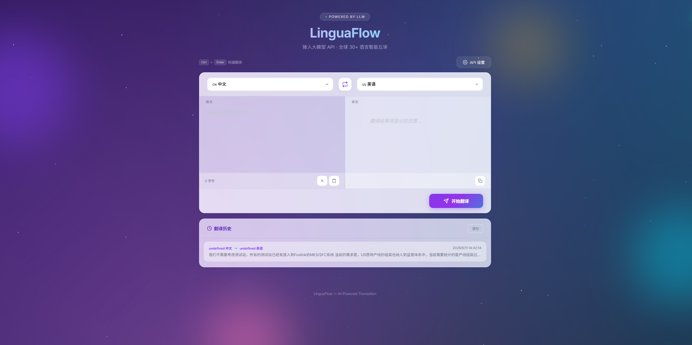

# LinguaFlow · AI Smart Translation

> An online translation tool powered by LLM APIs, supporting 30+ languages worldwide.


English | [中文](README.md)

---

## ✨ Features

- **30+ Languages** — Chinese, English, Japanese, Korean, French, German, Spanish, Russian, Arabic, and more
- **Flexible API** — Compatible with any OpenAI Chat Completions API provider (OpenAI, DeepSeek, Qwen, etc.)
- **Stunning UI** — Animated starry background, glassmorphism cards, gradient flow buttons
- **Typing Effect** — Translation results appear character by character for a smooth experience
- **Translation History** — Auto-saves up to 20 recent translations with one-click recall
- **Quick Actions** — Swap languages, paste from clipboard, clear, and copy results
- **Keyboard Shortcut** — `Ctrl + Enter` to translate instantly
- **Privacy First** — All settings and history stored locally in browser localStorage
- **Responsive Design** — Works seamlessly on desktop and mobile devices
- **Zero Dependencies** — Single HTML file, no installation required

## 📸 Preview

<p align="center">
  
</p>

## 🚀 Quick Start

### How to Use

1. Open `index.html` in any modern browser
2. Click the **"API 设置" (API Settings)** button in the top-right corner
3. Fill in the configuration:

| Field | Description | Example |
|-------|-------------|---------|
| **Base URL** | LLM API endpoint | `https://api.openai.com/v1` |
| **API Key** | Your API key | `sk-xxxxxxxxxxxxxxxx` |
| **Model** | Model name | `gpt-4o` / `deepseek-chat` |

4. Click **"保存配置" (Save)**
5. Select source and target languages, enter text, and click **"开始翻译" (Translate)**

### Supported API Providers

| Provider | Base URL | Model Examples |
|----------|----------|----------------|
| OpenAI | `https://api.openai.com/v1` | `gpt-4o`, `gpt-4o-mini` |
| DeepSeek | `https://api.deepseek.com/v1` | `deepseek-chat` |
| Qwen (Alibaba) | `https://dashscope.aliyuncs.com/compatible-mode/v1` | `qwen-plus` |
| Zhipu AI | `https://open.bigmodel.cn/api/paas/v4` | `glm-4-flash` |
| Moonshot | `https://api.moonshot.cn/v1` | `moonshot-v1-8k` |

> Any service compatible with the OpenAI `/chat/completions` endpoint will work.

## ⌨️ Keyboard Shortcuts

| Shortcut | Action |
|----------|--------|
| `Ctrl` + `Enter` | Start translation |

## 🛠️ Tech Stack

- Pure HTML + CSS + JavaScript (zero framework dependencies)
- Google Fonts (Inter + Noto Sans SC)
- OpenAI-compatible Chat Completions API

## 📁 Project Structure

```
translation_tool/
├── index.html          # Complete application (single file)
├── README.md           # Chinese documentation
└── README_EN.md        # English documentation
```

## 📋 Browser Compatibility

- Chrome 90+
- Edge 90+
- Firefox 88+
- Safari 15+

## 📝 Changelog

### v0.1 (2026-06-11)

- Initial release
- Support for 30+ languages
- Glassmorphism UI with animated starry background
- Typing effect for translation output
- Translation history (up to 20 entries)
- Responsive layout with mobile support

## 📄 License

MIT License
