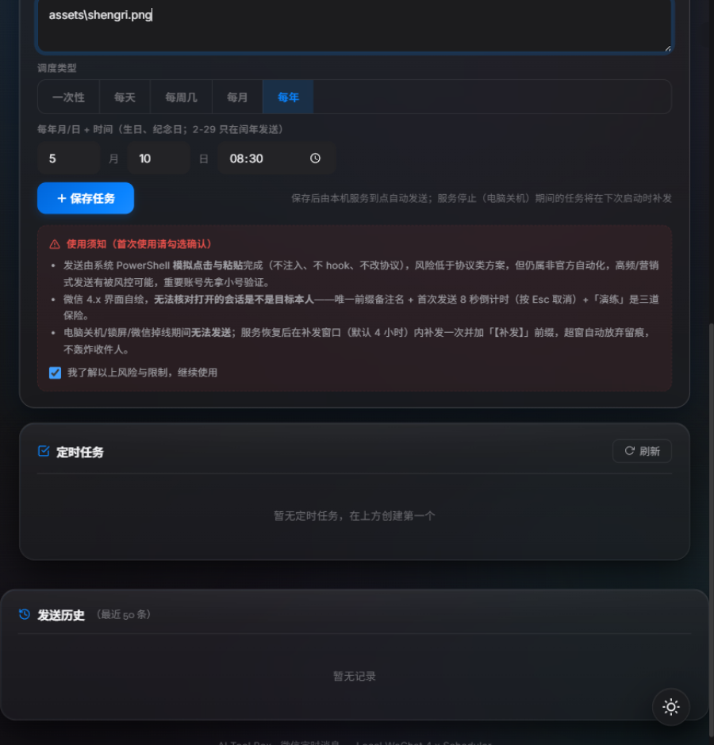
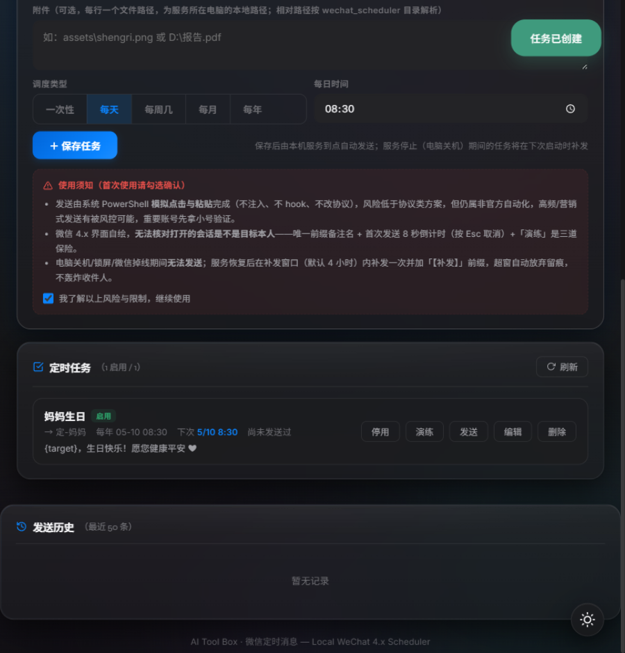
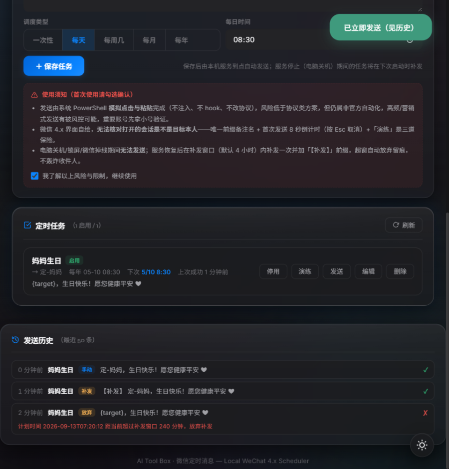

# 微信定时消息 · 使用指南（详细版 + Demo）

> 适用：LinguaFlow v0.27.0+ · Windows 10/11 · PC 微信 3.9 / 4.x（含 4.1.13）
> **默认通道零 pip 依赖**：只需 Python 3.9+，发送由系统自带 PowerShell（UIAutomation + Win32）完成。
> 截图均为 `--mock` 演示模式实拍（`demo/`），界面与真实模式一致。

---

## 1. 先说清楚：能做到什么、做不到什么

### 做得到

| 需求 | 支持 |
|---|---|
| 指定日期+时间发送 | ✅ 一次性 / 每天 / 每周几 / 每月 / 每年（生日纪念日，2-29 只在闰年） |
| 发给指定好友/群 | ✅ 按**会话名称**（备注名/群名）搜索定位 |
| 文字 + 图片/文件 | ✅ 内容支持 `{target}{date}{time}{note}` 占位符；附件按行填路径 |
| 电脑关机/锁屏后补发 | ✅ 恢复后在补发窗口（默认 4 小时）内补发，加「【补发】」前缀 |
| 防发错人 | ✅ 唯一前缀备注名 + 首次发送 8 秒倒计时（Esc 取消）+ 剪贴板回读校验 + 「演练」 |
| 防重复/防轰炸 | ✅ 幂等推进、同一时间点连败 5 次放弃、超窗放弃，全部留痕 |
| 手机远程管理 | ✅ 同一局域网 Wi-Fi 打开网页即可，任务数据在服务端天然多端一致 |

### 做不到（个人微信客户端的硬限制，不是本工具的问题）

1. **必须开机 + 微信已登录 + 不锁屏。** 个人微信没有服务端接口，一切发送都靠操作桌面上那个微信窗口；窗口关进托盘没关系（驱动会自动唤回，v0.27.0 修复）。关机期间到点的消息只能等开机补发；真要"关机也准点"只能换云端+官方推送通道。
2. **发送那几秒会接管微信窗口并抢一次焦点。** 定时点前后别正在打字/玩游戏；若前台被别的窗口抢占，工具会**放弃本次、稍后重试**，绝不会把字打进别的程序。
3. **微信 4.x 无法核对「打开的会话是不是目标本人」**（界面自绘不暴露控件树）。它能确认「文字确实落在了微信输入框里」（哨兵式剪贴板回读），但核对不了会话标题。微信 3.9 会自动启用 uia 模式做标题校验（最安全）。

### 因此必须遵守的约定

- **给每个定时对象设置唯一、带前缀的备注名**（如 `定-妈妈`、`定-张三`）。这不只是建议：微信 4.x 搜索下拉第一行常是「搜一搜」建议项，热词（如「文件传输助手」）直接回车会跳进网页搜索；独特前缀让下拉第一行就是目标本人。
- **第一次给某个对象发送前先「演练」**：会真实打开会话、把文字放进输入框并回读校验，但**不按回车、不发送**。肉眼看一眼打开的是不是那个人。
- 首次真实发送默认有 **8 秒倒计时**，按 Esc 可取消（该任务成功过一次后不再弹）。
- 定时点前后几分钟别手动操作微信（别留草稿、别停在搜索页）。

## 2. 原理

```
 手机浏览器                你的电脑（微信登录着）
┌──────────  局域网 HTTP  ┌────────────────────────────────────┐
│ 管理页    │ ───────────► │ wechat_scheduler 服务（纯标准库）    │
└──────────              │  任务/历史 data/*.json · 秒级调度     │
                          └──────────┬─────────────────────────┘
                                     │ subprocess（UTF-8 JSON 作业文件）
                          ┌──────────▼─────────────────────────┐
                          │ scripts/WeChatAuto.ps1（系统 PowerShell）│
                          │ 找窗口→点搜索框→粘贴名称→打开会话→    │
                          │ 哨兵回读校验→粘贴内容→回车；前台断言   │
                          └──────────┬─────────────────────────┘
                                     ▼
                          PC 微信窗口 ──► 好友 / 群
```

不注入、不 hook、不改协议——和真人操作没有区别，所以也继承了真人的限制（上面三条）。

## 3. 快速开始

```bat
:: ① 装 Python 3.9+（勾选 Add to PATH）；pyenv-win 用户无需 rehash，脚本会自己找到
:: ② 打开 PC 微信并登录
:: ③ 双击 wechat_scheduler\start_wx_scheduler.bat
```

浏览器打开 <http://127.0.0.1:8765/wechat_schedule.html>。先玩一遍演示：

```bat
python server.py --mock    :: 假发送真调度，全流程可看，不碰微信
```

## 4. 首次配置（三步把链路走实）

1. **环境体检**：页面「定时服务连接」卡点 **「环境体检」**。要点看两行——
   - `定位模式`：`uia`（3.9，可校验会话标题）或 `keyboard`（4.x，键盘+坐标，务必用前缀备注名）；
   - `微信窗口 ✓`：找不到就先启动微信并登录（窗口可以最小化，但别关到只剩托盘图标）。
2. **键盘链路校准（4.x 必做一次）**：体检输出里有 `search_click_abs / input_click_abs`（将要点击的坐标）。对照微信窗口看一眼，若偏了，在任务的 `options` 里写 `{"search_click_ax":234,"search_click_ay":60,"input_click_ax":700,"input_from_bottom":120}` 这类绝对像素值（左侧栏固定宽度，窗口拉大拉小坐标不动，一次校准全局复用——写进 defaults 级 options 即可）。
3. **演练 → 首发**：建一条发给「文件传输助手」的任务（它是热词，`options` 用 `{"open_method":"click","result_click_ax":215,"result_click_ay":337}` 点下拉结果行），点任务卡 **「演练」** 看会话是否正确打开，再点 **「发送」**（首次有 8 秒倒计时，Esc 取消）。

## 5. 创建任务



- **接收人**：填会话名称（装了 wechatauto-replica 才有搜索下拉，不装直接手填，效果一样）。
- **内容**：多行文本 + 占位符。生日模板示例：`{target}，生日快乐！`——`{date}` 渲染为计划日期、`{note}` 是你填的备注。
- **附件**：每行一个路径（服务所在电脑的本地文件；相对路径按 `wechat_scheduler/` 解析）。先发图再发文字：`options: {"files_first": true}`。
- **调度**：一次性 / 每天 / 每周几（多选）/ 每月（1-31，当月无此日可选"提前到月末"或"跳过"）/ 每年（月+日）。



任务卡按钮：**停用/启用**（启用自动重算下次时间）· **演练**（打开会话+校验，不发送）· **发送**（立即发一次，记「手动」）· **编辑** · **删除**。

## 6. 补发、放弃与重试（重点）

服务每 1 秒扫描。到点没发出去的任务（关机/锁屏/掉线），恢复后：

| 情况 | 行为 |
|---|---|
| 滞后 ≤ 补发窗口（默认 240 分钟，`options.catch_up_minutes` 可调） | 补发 1 条，内容前加「【补发】」，历史带「补发」徽章 |
| 周期任务停机期间错过多次 | **只补最近 1 次**，其余折叠跳过（不轰炸） |
| 滞后 > 补发窗口 | **放弃**，历史留「放弃」记录与原因 |
| 同一计划点连续失败 5 次 | 放弃该时间点并推进（防无限重试刷屏） |
| 一次性任务 | 无论成功或放弃，之后自动停用 |



## 7. 聊天记录 AI 总结

快速了解某个好友/群在指定时间段里聊了什么、有什么要办的事。

**前提**：装了 `wechatauto-replica`（`pip install wechatauto-replica winsdk pypinyin`，你机器已装）+ PC 微信保持登录 + 页面内配置大模型接口（与智能翻译等模块共享同一份 API 配置）。

**流程**：「聊天记录 AI 总结」面板 → 选会话（**点开输入框即自动弹出联系人/群列表**；服务重启后首次拉取约 20 秒，10 分钟内二次打开秒出，也可直接手输名称）→ 时间范围（今天/昨天/近3天/近7天/自定义）→ **读取聊天记录**（显示命中条数与原文预览；引用/卡片消息自动清洗协议噪音只留语义文本）→ 选 **输出语言**（中/英/日/韩/法/德/西/俄/阿/葡，与工作报告输出语言同一份表）→ **✨ AI 总结** → 输出三段式结果：

- 📌 内容重点（按话题的结论与决定）
- ✅ 待执行任务（表格：任务/责任人/优先级/截止时间）
- ⏰ 关键时间点

结果可 **复制** 或一键 **微信格式**（展开区+独立复制按钮，同工作报告页）；还可 **下载 Markdown**（原始语法文件）与 **下载 HTML**（独立排版报告，含任务表格与元信息，浏览器直接打开/打印/转发）；**「清除」**一键清空本次加载的记录与总结结果（不影响总结记录存档）；每次总结自动存入「总结记录」（服务端保存，手机/电脑看到同一份，可展开回看、单条删除、清空）。

**隐私**：消息只从你本机微信数据目录解密读取，除你自配的 AI 接口外不发往任何第三方；图片/语音只以 `[图片]` 占位参与总结（不做内容识别）。

## 8. 数据与云同步（Google Drive）+ 服务免手动

**前提**：电脑上装了 **Google Drive 桌面客户端**（它有本地同步文件夹，放进去的文件自动上云）。我们只读写那个本地文件夹，不碰 Google API、不需要授权。

**配置（一次性）**：「微信工具」页底部「数据与云同步」卡片 → 点 **「浏览…」**，输入框下方展开**内嵌目录浏览器**（服务实时列出本机盘符与文件夹，逐级点选，「选用此目录」回填路径；也可手动输入）→ 点「保存并测试」——服务会立刻试写一个真实备份验证路径可写。数据存放在 `<你选的路径>/LinguaFlow/` 子文件夹里，不污染 Drive 根目录。

**同步什么**：所有模块的浏览器数据（翻译历史/草稿、工作报告、任务清单、英语学习、邮件总结、AI 解析/提示词、主题、微信工具的任务/发送历史/AI 总结记录）。各页面开着就会自动把变化推给服务（服务没启动时静默跳过，不打扰）。

| 操作 | 说明 |
|---|---|
| 自动备份（默认开） | 数据变化后 5 秒去抖写入；每天一份快照 `backup-YYYY-MM-DD.json`（保留 14 天）+ 永远最新的 `latest.json` |
| 立即备份 | 手动触发一次 |
| 从 Drive 恢复 | 用 `latest.json` 覆盖本地（有二次确认；恢复后页面自动刷新） |
| 快照列表 | 每份快照可单独「下载」或「恢复」——误删数据可回滚到任意历史日 |
| 导入/导出本地 JSON | 导出=当前备份包下载；导入=选一个之前导出的 JSON 文件恢复（换设备/离线场景） |

⚠️ **备份包永不含 API Key 与服务口令**（客户端+服务端双重剥离）。新设备恢复后，只需在「API 设置」重新填一次 Key，其余数据原样回来。

**服务免手动**：
- **注册开机自启**（推荐，一键）：点卡片底部「注册开机自启」，服务把自己写入 Windows 登录计划任务（静默无黑窗）。之后每次开机登录，服务自动在跑——打开网页/插件即用，永远不用再碰 `start_wx_scheduler.bat`。
- **一键拉起服务**（可选增强）：若你常用的是装了 Chrome 扩展的浏览器，可在 `chrome_extension/` 目录运行 `install_native_host_win.bat <扩展ID>`（扩展 ID 在 chrome://extensions 查看）注册原生通道；之后服务没在跑时，页面会出现「一键拉起服务」按钮，点一下即静默启动。不想折腾就跳过，开机自启已覆盖日常。

## 9. 手机访问（局域网）

手机与电脑连同一路由、防火墙放行 8765 后，打开 `http://<电脑IP>:8765/wechat_schedule.html`——服务地址自动就是当前来源，打开即已连接；建的任务与电脑端同一份。电脑关机时手机也打不开页面（服务在电脑上），但任务不丢，开机后按 §6 补发。

## 10. options 可用参数（写进任务的 options，或全局默认）

| 键 | 默认 | 说明 |
|---|---|---|
| `catch_up_minutes` | 240 | 补发窗口（分钟） |
| `confirm_first_send` | true | 该任务首次真实发送前 8 秒倒计时（Esc 取消） |
| `confirm_every_send` | false | 每次发送都要倒计时（重要对象） |
| `verify_input` | true | 哨兵式剪贴板回读校验（强烈建议保持） |
| `files_first` | false | 先附件后文字 |
| `gap_seconds` | 1.5 | 多文件/多条之间的间隔 |
| `search_click_ax / _ay` | — | 搜索框点击绝对坐标（4.x 校准，见 §4.2） |
| `input_click_ax / input_from_bottom` | — | 输入框点击校准 |
| `open_method` | `enter` | 热词目标用 `click` + `result_click_ax/_ay` 点下拉结果 |
| `auto_launch` | true | 微信没开时自动拉起微信进程（不会重复登录） |

## 11. API Demo

```bash
curl http://127.0.0.1:8765/api/status      # 服务与通道状态
curl http://127.0.0.1:8765/api/doctor      # 环境体检（窗口/锁屏/定位模式/微信版本）
curl -X POST http://127.0.0.1:8765/api/tasks -H "Content-Type: application/json" ^
  -d @task.json                            # 中文内容请走文件体（-d @file），避免控制台编码坑
curl -X POST http://127.0.0.1:8765/api/tasks/<id>/dryrun   # 演练
curl -X POST http://127.0.0.1:8765/api/tasks/<id>/run      # 立即发送
curl "http://127.0.0.1:8765/api/history?limit=10"
```

task.json 结构与 schedule 五种模型见 [README.md](README.md) §三。

## 12. 常见问题

| 现象 | 原因与解决 |
|---|---|
| 体检/发送报 code 10「未找到微信主窗口」 | 窗口缩进托盘会自动唤回；仍报 10 = 微信没启动或没登录——启动并登录后再点「发送」重测 |
| code 11 屏幕锁定 | 锁屏收不到键盘输入。解锁后会在补发窗口内自动重试；长期方案是不锁屏（电源设置）或换云方案 |
| code 18 输入框回读失败、或会话打开成「搜一搜」网页 | 4.x 搜索下拉坑：用唯一前缀备注名，或该任务 `options` 设 `open_method:"click"` + 结果行坐标 |
| code 13 搜索框没收到文本 | 坐标偏了，按 §4.2 校准 `search_click_ax/ay` |
| 双击 bat 报「未找到可用的 Python 3」但装了 pyenv | shims 未 rehash。bat 已自动扫描 `~\.pyenv\pyenv-win\versions`；想修全局命令跑 `pyenv rehash` |
| 读取聊天记录报「database disk image is malformed」 | **你的微信数据没坏**——微信正活跃写入时，上游读到撕裂的临时合并副本（常见于刚聊过的群）。服务内置三级自愈：重置连接重试 → 清临时合并缓存强制重建 → 个别成员昵称查不到时降级显示 ID、不阻断整次读取（日志可见）。多数情况自动恢复；若仍持续报错，完全退出并重启 PC 微信（触发 WAL 检查点）再试 |
| 端口 8765 被占用 | 多半服务已在运行，直接打开页面；确需第二实例 `--port 8766` |
| 云同步卡片显示「从未备份」 | 检查 Drive 路径是否已「保存并测试」、自动备份开关是否为「开」、路径是否真实存在可写；Google Drive 客户端只负责把该文件夹内容上云 |
| 恢复后 API 要重填 | 设计如此——备份永不含 Key。重填一次即全部恢复 |
| 附件发送失败「文件不存在」 | 路径以**服务所在电脑**为准；相对路径按 `wechat_scheduler/` 解析（例：`assets/shengri.png`） |
| 发送时微信窗口弹到前台 | 设计如此（模拟操作），那几秒别抢键盘鼠标 |
| 手机打不开页面 | 同一 Wi-Fi（别一个连光猫一个连路由）、防火墙放行、IP 用启动日志里那个 |
| 想改端口/口令/数据目录 | `--port` / `--token`（页面「访问口令」填同一个值）/ `--data-dir` |

## 13. 安全与风险

1. **封号风险**：虽不注入不 hook，仍属非官方自动化；只用于给熟人发提醒祝福，控制频率（内置 ≥1s 间隔与重试上限）。重要账号先小号验证。
2. **数据与权限**：任务/历史明文在 `data/`；默认无鉴权，公网/办公网环境务必 `--token`。
3. **别在另一台机器同时跑两个服务连同一个微信**——有发送锁互斥，但体验会互相干扰。

## 14. 自检与回归（开发者）

```bat
python tests\test_scheduler_logic.py                    :: 排期纯函数（含 monthly/yearly/clamp/闰年）
node tests\wx-scheduler-mock.e2e.mjs                    :: mock 端到端 19 项（CRUD/定时/补发/超窗放弃/演练拒绝/静态托管）
python server.py --mock                                 :: 手动走 UI 流程
curl http://127.0.0.1:8765/api/doctor                   :: 真机体检（psauto）
```

---

*文档版本：v0.27.0 · 2026-09-13。发送引擎移植自真机打磨的 wxtimer 项目（PS 驱动 `scripts/WeChatAuto.ps1`），部署与接口细节见 [README.md](README.md)。*
